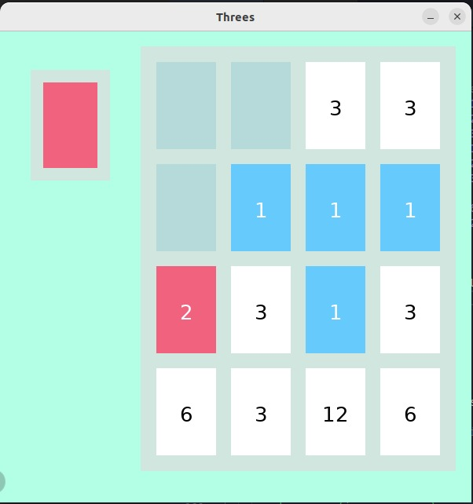

# Threes
 This is a game developed in the first semester of my graduation using C and Allegro
 
# Running
### Download Allegro
[Link](https://github.com/liballeg/allegro_wiki/wiki/Quickstart)
### Run
`gcc -Wall -o main  main.c tela.c -lallegro_font -lallegro_color -lallegro_ttf -lallegro_primitives -lallegro`
### Game Images

